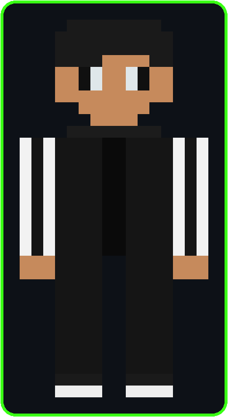

<div align="center">


<a href="https://github.com/ahmadsetiawande">
  
</a>


</div>

<br>

## 💻 `terminal.exe` — neofetch --player

<table>
<tr>
<td></td>
<td>

```
ahmadsetiawande@github
────────────────────────
OS         : Web Developer v2.0
Class      : Full-Stack Adventurer
Guild Hall : Tangerang, Indonesia 🇮🇩
Quest      : AI-powered web apps
Level      : Journeyman ⚔️
HP         : ❤️❤️❤️❤️❤️
XP Bar     : 🟩🟩🟩🟩⬜ (Lv. Up soon)
```

</td>
</tr>
</table>

## 🤖 `chat.log` — talking with my AI sidekick

```bash
$ chat --with aone-ai

You      : who are you?
Aone-AI  : Developer yang suka ngoprek AI API & bikin web app dari nol ⚡
You      : skill andalan?
Aone-AI  : JavaScript, Python, C#, dikit-dikit Next.js dan integrasi AI
You      : lagi ngerjain apa sekarang?
Aone-AI  : Lagi push commit... sesekali healing di Minecraft 🌲⛏️
```

## ⚒️ `inventory.json` — tech stack

<div align="center">


</div>

## 🌲 `crafting_table.recipe`

```bash
$ cat recipe.txt

[ Ahmad Setiawan ]
ingredients:
  - 2x Rasa Penasaran
  - 3x Kopi ☕
  - 1x Keyboard (agak aus)
  - ∞  Bug Report

craft >> Full-Stack Developer & AI Enthusiast ✅
```

## 🏆 `achievements/`

<div align="center">


<br><sub>Belajar integrasi AI ke aplikasi web (aoneface_openrouter)</sub>


<br><sub>Menyelesaikan proyek UAS Algoritma Pemrograman</sub>


<br><sub>Publish situs portofolio pertama (ahmadsetiawande.github.io)</sub>

</div>

## 🎒 `hotbar.dat` — perks & traits

<div align="center">


</div>

## 📊 `stats.render()`

<div align="center">


</div>

## 📈 `activity_graph.render()`

<div align="center">


</div>

## 🐍 `snake.exe` — kontribusi jadi game

<div align="center">

<picture>
  <source media="(prefers-color-scheme: dark)" srcset="https://raw.githubusercontent.com/ahmadsetiawande/ahmadsetiawande/output/github-contribution-grid-snake-dark.svg" />
  <source media="(prefers-color-scheme: light)" srcset="https://raw.githubusercontent.com/ahmadsetiawande/ahmadsetiawande/output/github-contribution-grid-snake.svg" />
  
</picture>

<sub>*butuh setup GitHub Action sekali (lihat langkah di chat) — sebelum itu jalan, gambar di atas belum muncul*</sub>

</div>

## 📡 `connect.sh`

<div align="center">

<a href="https://www.instagram.com/awan.wannde/"></a>
<a href="https://www.tiktok.com/@aonedeee"></a>

</div>

<br>

<div align="center">


<sub>&gt; process finished with exit code 0 ✅ — terima kasih sudah mampir, respawn lagi lain kali 🌲</sub>

</div>
